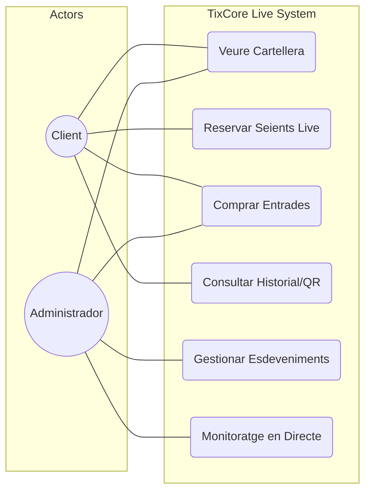
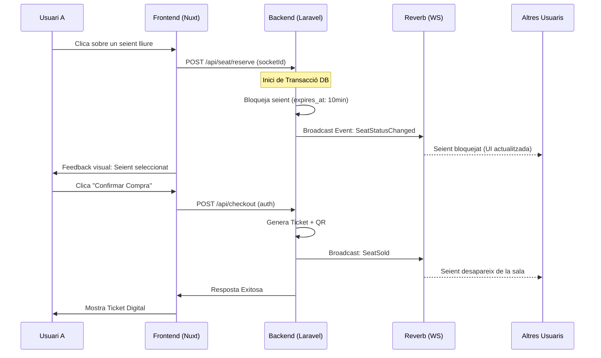
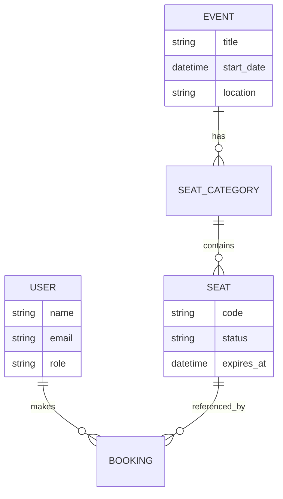

# TixCore Live - Plataforma de Ticketing en Temps Real


**Curs:** 2DAW 2023-2024 (Projecte Transversal)  
**Autor:** Aaron Soriano Ponce  
**URL de Producció:** [tixcore.daw.inspedralbes.cat](http://tixcore.daw.inspedralbes.cat/)

---

## 🎯 Objectiu del Projecte
**TixCore Live** és una solució integral per a la gestió i venda d'entrades que posa el focus en la **immediatesa**. Mitjançant l'ús de WebSockets de baixa latència, la plataforma permet una experiència d'usuari dinàmica on els seients es bloquegen i s'actualitzen visualment per a tots els usuaris connectats de forma instantània.

### Problemes que resol:
- **Col·lisions de compra:** Evita que dos usuaris intentin comprar el mateix seient simultàniament.
- **Disfaja d'informació:** Garanteix que l'estat de la sala és el real en tot moment sense haver de refrescar.
- **Gestió Administrativa "Live":** Els administradors poden veure com s'omplen les sales en temps real.

---

## 🏗️ Arquitectura i Tecnologies

El projecte utilitza una separació total entre frontend i backend, comunicant-se mitjançant una API RESTful i un canal duplex de dades.

### Backend (The Engine)
- **Framework:** Laravel 11 (PHP 8.2+).
- **Real-time Server:** **Laravel Reverb** (Servidor de WebSockets nadiu de Laravel).
- **Base de Dades:** MySQL amb transaccions ACID per garantir la integritat de les reserves.
- **Autenticació:** Laravel Sanctum (Stateful per a sessions de navegador).
- **Eines:** Eloquent ORM, Service Pattern per a la lògica de negoci.

### Frontend (The Interface)
- **Framework:** Nuxt 3 (Vue.js 3).
- **Gestió d'Estat:** **Pinia** (Gestió reactiva de l'idioma i el carret de compra).
- **Comunicació WS:** **Laravel Echo** integrat amb Nuxt per subscripcions a canals privats i públics.
- **UI/UX:** Tailwind CSS + Nuxt UI. Disseny focalitzat en "Dark Mode" i accessibilitat.

---

## 📊 Diagrames del Sistema

### 1. Casos d'Ús


### 2. Flux de Reserva (Real-Time)


### 3. Model de Dades Simplificat


---

## 📁 Estructura del Projecte

```text
porjectofinal/
├── backend/            # API Laravel 11
│   ├── app/            # Lògica (Controllers, Models, Services)
│   ├── routes/         # Endpoints (api.php, channels.php)
│   ├── database/       # Migracions i Seeds
│   └── tests/          # Feature & Unit tests
├── frontend/           # App Nuxt 3
│   ├── app/            # Vue layouts i main entry
│   ├── components/     # Components modulars (SelectorSeients, Header)
│   ├── pages/          # Rutes de l'aplicació
│   └── stores/         # Pinia (i18n, auth, seients)
├── docs/               # Documentació tècnica i prompts logs
└── specs/              # Fitxers de planificació (OpenSpec)
```

---

## 🚀 Instal·lació i Desenvolupament

### Requisits Previs
- PHP 8.2+ i Composer
- Node.js 18+ i npm/pnpm
- MySQL 8.0+

### Pas 1: Configuració del Backend
1. Entra al directori: `cd backend`
2. Instal·la dependències: `composer install`
3. Configura l'entorn: `cp .env.example .env` (edita els paràmetres de la DB)
4. Crea la clau d'aplicació: `php artisan key:generate`
5. Executa migracions i dades de prova: `php artisan migrate --seed`
6. Aixeca el servidor: `php artisan serve`
7. **IMPORTANT:** En una altra terminal, inicia el servidor de WebSockets: `php artisan reverb:start`

### Pas 2: Configuració del Frontend
1. Entra al directori: `cd frontend`
2. Instal·la dependències: `npm install`
3. Executa en mode desenvolupament: `npm run dev`
4. Obre [http://localhost:3000](http://localhost:3000)

---

## 🛠️ Endpoints Principals (API)

| Mètode | Endpoint | Descripció |
|---|---|---|
| GET | `/api/esdeveniments` | Llista tots els esdeveniments actius. |
| GET | `/api/esdeveniments/{id}` | Detall d'un esdeveniment i la seva sala. |
| POST | `/api/seients/reservar` | Bloqueja un seient temporalment via SocketID. |
| POST | `/api/pagament` | Processa la compra i genera el ticket. |
| GET | `/api/usuari/tickets` | Historial de compres de l'usuari. |

---

## 🔮 Roadmap / Millores Futures
- [ ] Integració amb passarel·la de pagament real (Stripe).
- [ ] Generació de PDF per als tickets.
- [ ] Aplicació de lectura de QR per als accessos.
- [ ] Sistema de preus dinàmics segons demanda.

---

**Llicència:** Aquest projecte és per a ús acadèmic sota llicència MIT.
