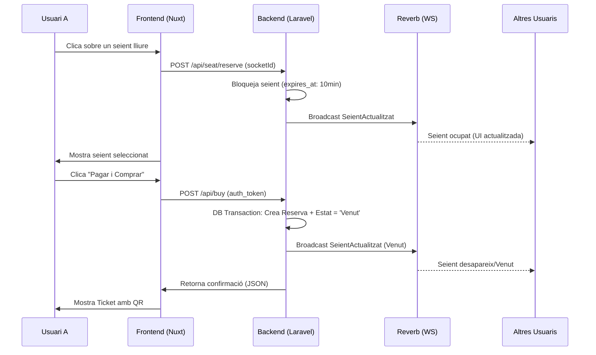
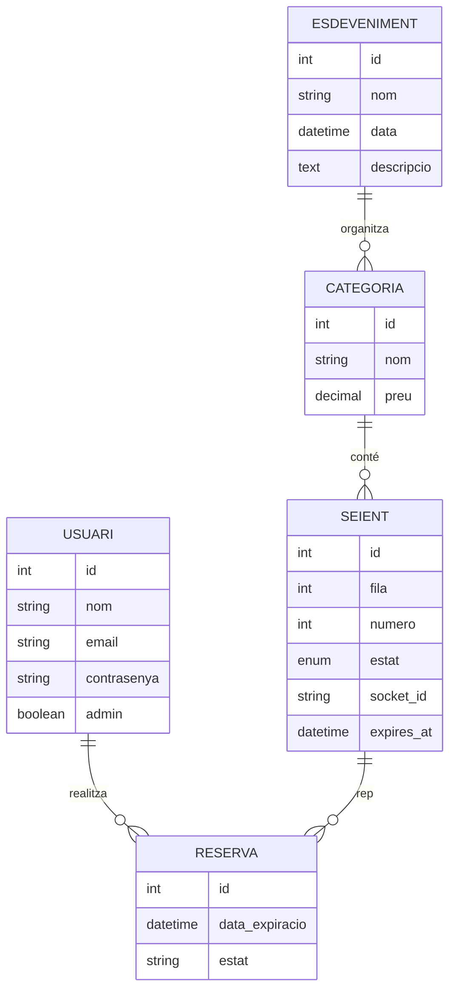

# TixCore Live - Plataforma de Ticketing en Temps Real

**Curs:** 2DAW 2023-2024 (Projecte Transversal)  
**Autor:** Aaron Soriano Ponce  
**URL de Producció:** [tixcore.live](https://tixcore.live) (Exemple)

---

## 🎯 Objectiu del Projecte
L'objectiu de TixCore Live és oferir una experiència de compra d'entrades ultra-ràpida i interactiva. A diferència de les plataformes tradicionals, permet el bloqueig de seients en temps real mitjançant WebSockets, evitant col·lisions entre usuaris i garantint que la disponibilitat que es veu a la pantalla és sempre la real i actualitzada al mil·lisegon.

## 🏗️ Arquitectura i Tecnologies
El projecte segueix una arquitectura de desacoblament total entre el client i el servidor:

- **Backend (Laravel 11)**: Actua com una API REST robusta. Gestiona l'autenticació (Sanctum), la persistència de dades (Eloquent) i el motor de temps real mitjançant **Laravel Reverb**.
- **Frontend (Nuxt 3)**: Aplicació d'última generació que utilitza SSR (Server Side Rendering) i Composition API. Gestiona l'estat global amb **Pinia** i la comunicació de rutes amb **Laravel Echo**.
- **Disseny (Nuxt UI & Tailwind)**: Interfície premium de tipus "Dark Mode" amb components modulars i animacions de micro-interacció.

## 📊 Diagrames del Sistema

### 1. Casos d'Ús
```mermaid
useCaseDiagram
    actor Client
    actor Admin
    
    package "TixCore Live" {
        usecase "Veure Cartellera" as UC1
        usecase "Reservar Seients (Temps Real)" as UC2
        usecase "Comprar Entrades" as UC3
        usecase "Consultar Historial/QR" as UC4
        usecase "Gestionar Esdeveniments" as UC5
        usecase "Monitoratge de Sales Live" as UC6
    }
    
    Client --> UC1
    Client --> UC2
    Client --> UC3
    Client --> UC4
    
    Admin --> UC5
    Admin --> UC6
    Admin --> UC1
```

### 2. Procés de Reserva i Compra (Temps Real)


### 3. Model Entitat-Relació


---

## 🚀 Instal·lació i Desenvolupament

### Backend
1. `cd backend && composer install`
2. `cp .env.example .env` i configurar la DB
3. `php artisan migrate --seed`
4. `php artisan serve` i `php artisan reverb:start`

### Frontend
1. `cd frontend && npm install`
2. `npm run dev`
